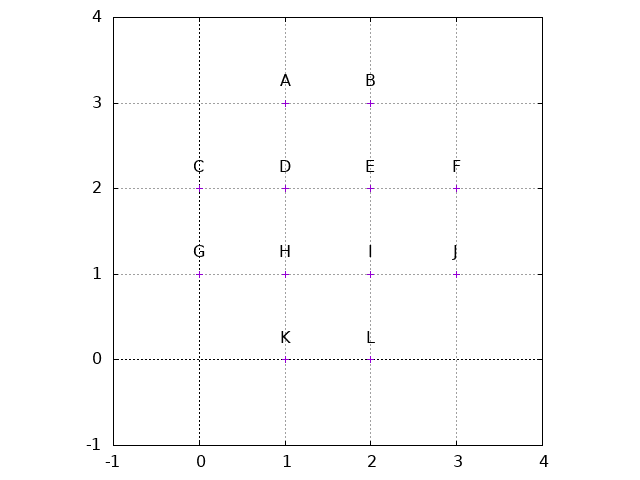
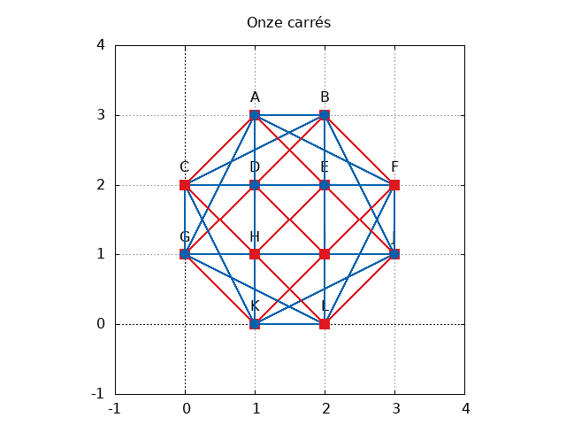

- [Demande](#demande)
- [Analyse](#analyse)
  - [Remarque](#remarque)
- [Réalisation](#ralisation)
  - [Détails](#dtails)
- [Validation](#validation)
- [Tests](#tests)
- [Exécution](#excution)
- [Améliorations](#amliorations)
- [Divers](#divers)


<a id="demande"></a>

# Demande

Soit un fichier contenant un ensemble de points dans un espace à deux dimensions. Le fichier est composé de lignes, chacune d&rsquo;elle contient un point représenté par ses coordonnées sous la forme suivante :

```txt
x y
```

À partir de l&rsquo;ensemble de ces points, combien de carrés est-il possible de former. S&rsquo;il n&rsquo;y en a pas comment le démontrer ?

Exemple : les coordonnées ci-dessous forment un carré valide

| x  | y  | label |
| 1  | -4 | A     |
| 4  | -2 | B     |
| -1 | -1 | D     |
| 2  | 1  | C     |


<a id="analyse"></a>

# Analyse

Pour chaque coupe de points (A, B) dans le plan il est possible de déterminer quatre autres point A&rsquo;, A&rsquo;&rsquo; et B&rsquo;, B&rsquo;&rsquo; tels qu&rsquo;à eux 8 ils forment deux carrés.

Dans l&rsquo;exemple précédent si A = (1, -4) et B = (4, -2) alors il est possible de calculer des valeurs pour A&rsquo;, A&rsquo;&rsquo; et B&rsquo;, B&rsquo;&rsquo; telles qu&rsquo;il soit possible de former deux carrés.

```
  A' = (-1, -1) et A" = (3, -7)
  B' = (2, 1) et B" = (6, -5)
```


À partir de cela il est possible de rechercher dans la liste des points s&rsquo;il existe des points correspondants à A&rsquo;, A&rsquo;&rsquo; et B&rsquo;, B&rsquo;&rsquo;.

Si l&rsquo;on décide de trier les points en partant des plus petites valeurs de x et de y jusqu&rsquo;aux plus grandes (d&rsquo;en bas à gauche vers en haut à droite) alors il est possible de ne considérer que les points A&rsquo; et B&rsquo; qui se situent au-dessus de A dans le calcul. Cela est possible, car les points situés au-dessous sont soit inexistant dans l&rsquo;ensemble des points donnés (le point A est le plus en bas à gauche) soit ont déjà été traités par les itérations précédentes et ont donc déjà été ajoutés à la liste des carrés identifiés.

Cela permet d&rsquo;extraire la formule suivante pour calculer les coordonnées de A&rsquo; et B&rsquo; :

```
  A'.x = A.x - (B.y - A.y)
  A'.y = A.y + (B.x - A.x)

  B'.x = B.x - (B.y - A.y)
  B'.y = B.y + (B.x - a.x)
```

Il est également possible d&rsquo;améliorer le parcours en ignorant les points situés à gauche ou verticalement du point d&rsquo;origine. En effet, soit ceux-ci font partie d&rsquo;un carré dont l&rsquo;autre côté est situé à droite du point d&rsquo;origine (qui a déjà été détecté si son angle fait plus de 45° ou qui sera détecté plus tard si l&rsquo;angle fait moins de 45°).


<a id="remarque"></a>

## Remarque

Le fichier contient des doublons :

```sh
❯ cat ../../exercice.txt| sort -n | uniq -dc | wc -l
18
❯ cat ../../exercice.txt| sort -n | uniq -dc
      2 -997 -585
      2 -895 -593
      2 -867 673
      2 -844 -151
      2 -759 -190
      2 -615 97
      2 -380 754
      2 -289 -146
      2 -203 -394
      2 308 847
      2 331 -818
      2 366 -960
      2 383 870
      2 402 -528
      2 416 2
      2 581 188
      2 773 450
      2 786 660
```

J&rsquo;ai pris le partis de considérer qu&rsquo;il s&rsquo;agissait d&rsquo;une erreur dans le fichier et de ne conserver qu&rsquo;une seule occurrence (Cela est fait en utilisant un `SortedSet` qui exclut les doublons lors de l&rsquo;ajout).


<a id="ralisation"></a>

# Réalisation

Le langage choisi est le C#.

L&rsquo;idée générale est la suivante :

1.  Lire chaque ligne du fichier et la stocker dans une structure ordonnée,
2.  Parcourir la structure dans l&rsquo;ordre
3.  Pour chaque point, parcourir la suite de la structure et calculer les points possibles pour un carré,
    1.  Vérifier si le point existe
    2.  Ajouter le carré à la liste s&rsquo;il n&rsquo;existe pas déjà


<a id="dtails"></a>

## Détails

Les points seront stockés dans un objet `Point` définis comme suit:

```csharp
namespace SquareFinder;

public class Point
{
    public Point()
    {
    }

    public Point(int x, int y)
    {
        X = x;
        Y = y;
    }

    public Point(Point a)
    {
        X = a.X;
        Y = a.Y;
    }

    public int X { get; set; }
    public int Y { get; set; }

    public override string ToString()
    {
        return $"({X}, {Y})";
    }
}
```

L&rsquo;idée générale est de stocker l&rsquo;ensemble des points dans une structure de données permettant un accès rapide pour la vérification de la présence des points. Un `SortedSet<Point>` est utilisé avec un `PointComparer` pour trier l&rsquo;ensemble.

```csharp
namespace SquareFinder;

public class PointComparer : IComparer<Point>
{
    public int Compare(Point? a, Point? b)
    {
        if (a is null && b is null) return 0;
        if (a is null) return -1;
        if (b is null) return 1;

        var yDelta = a.Y - b.Y;
        var xDelta = a.X - b.X;

        return yDelta == 0 ? xDelta : yDelta;
    }
}
```

Les accès au point depuis le `SortedSet` sont garantis en `O(log n)` par l&rsquo;implémentation de Microsoft ([SortedSet<T>.Contains(T) Method](https://docs.microsoft.com/en-us/dotnet/api/system.collections.generic.sortedset-1.contains?view=net-6.0))

Puis pour chacun des points présent dans le set parcourir l&rsquo;ensemble des points situés plus avant, calculer les points possibles pour un carré et vérifier s&rsquo;ils existent.

Si oui, ajouter le carré trouvé à la liste des carrés en triant les sommets par ordre croissant dans le plan (comme pour les points en entrés).

La liste des carrés trouvés est également un `SortedSet` mais un `SortedSet<Square>`. Cela permet de ne pas créer de doublons lors de du parcours. En effet lors du parcours, B et A&rsquo; seront présent dans le parcours.

Il y a sans doute une amélioration à ajouter pour détecter ce cas pour éviter d&rsquo;avoir recours à cette structure de donnée.


<a id="validation"></a>

# Validation

Un ensemble de tests unitaires a été ajouté pour valider les composants séparément.


<a id="tests"></a>

# Tests

Soit l&rsquo;ensemble de points suivants :



Le résultat est celui-là :




<a id="excution"></a>

# Exécution

Lancement depuis la ligne de commande

```shell
time dotnet run --project SquareFinder/SquareFinder/SquareFinder.csproj exercice.txt
```

```sh
❯ time dotnet run ../../exercice.txt
List of points contains 9982 elements.
First / last  point (-737, -1000) / (394, 999).
First / last  x -1000 / 999.
First / last  y -743 / 269.
Found 56 !
dotnet run ../../exercice.txt  11,01s user 0,20s system 102% cpu 10,899 total
╭─    ~/Travail/VCS/SquareFinder/SquareFinder    master        ✔  13s 
╰
```

Ce qui donne 56 carrés trouvés en 28 secondes.


<a id="amliorations"></a>

# Améliorations

Pour optimiser le temps d&rsquo;exécution, j&rsquo;ai l&rsquo;intuition qu&rsquo;il est possible d&rsquo;arrêter les parcours des points A et B, en utilisant les propriétés du plan (min et max des coordonnées) mais je n&rsquo;ai pas réussi à trouver comment.

J&rsquo;ai exclu les améliorations suivantes :

-   Détecter que tous les points sont sur la même droite (le cas n&rsquo;est pas présent dans le fichier),
-   Détecter qu&rsquo;il n&rsquo;y a pas assez de points pour former un carré (le parcours étant très rapide dans ce cas-là ce n&rsquo;est sans doute pas utile).


<a id="divers"></a>

# Divers

Visualisation des données founies dans le fichier `exercice.txt`:

